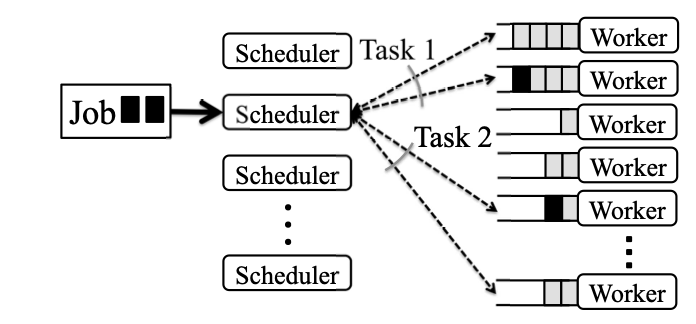
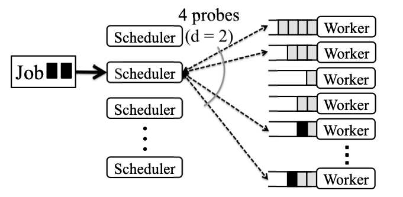
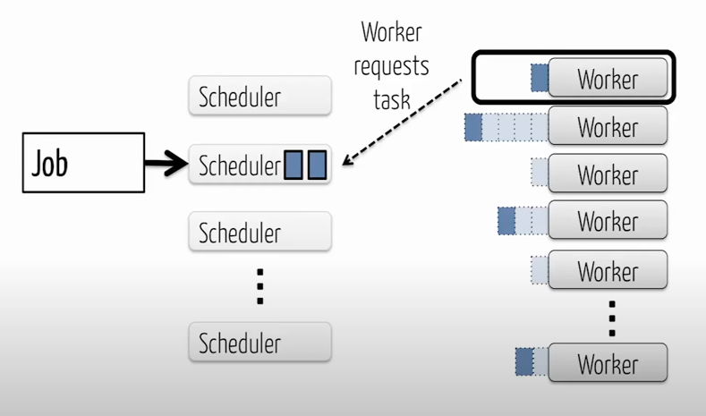
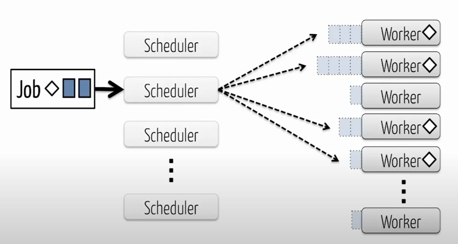
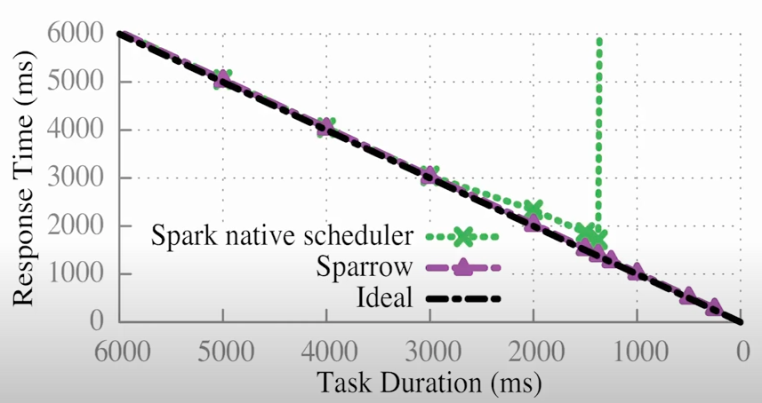
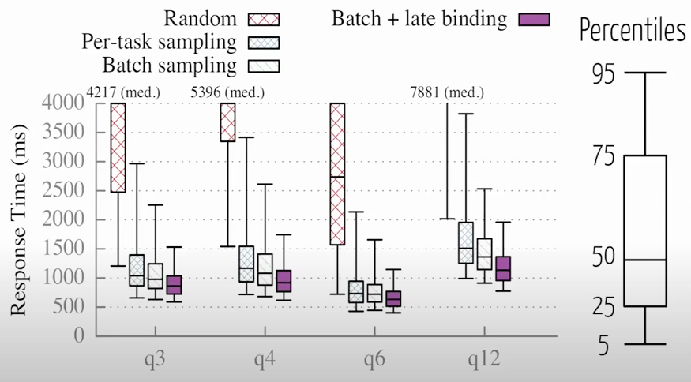
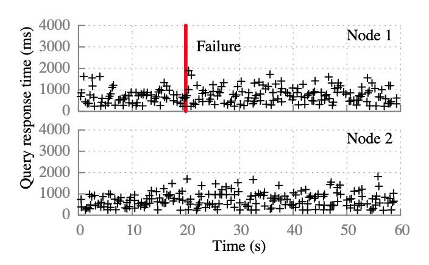
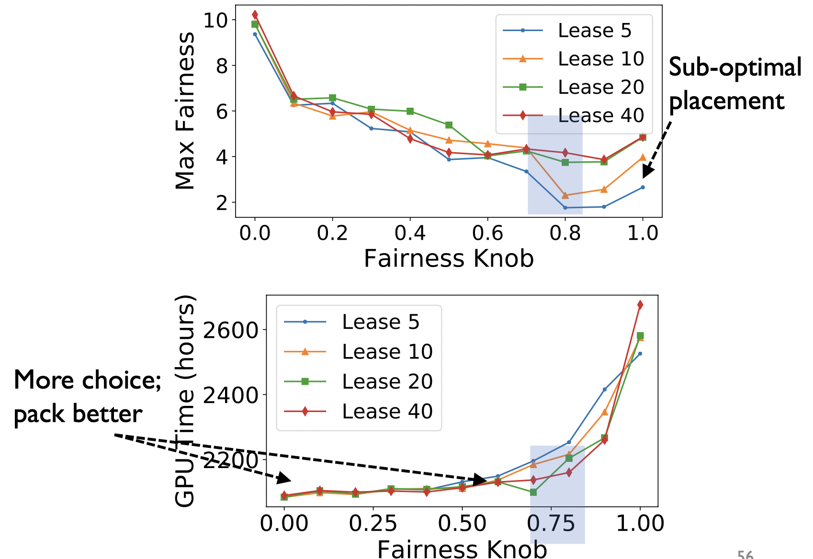
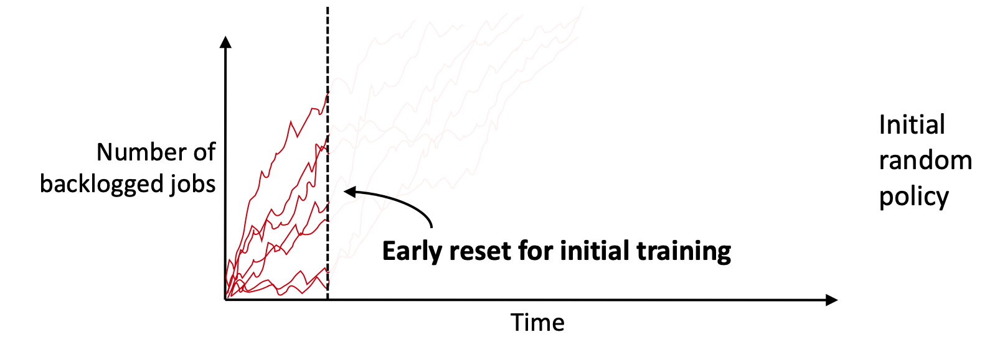

# Introduction
Schedulers handle all aspects regarding which job is run where and what resources are allocated and which jobs are prioritized. The relevant algorithm is called the scheduling policy. Sometimes, when there is a spike in the number of jobs or more specifically, the usage of resources, a few jobs which can't be performed are rejected and not scheduled. This aspect of schedulers is called admission control. It is to be noted that any job which gets through admission control will eventually get scheduled.

There are various factors that affect a scheduler's admission control and scheduling policy, namely:
-   Scalability
-   Scheduling Latency
-   Quality of the scheduling decisions
-   Possibility of starvation
-   Duration of the tasks
-   Prioritization and Fairness

Each of these attributes are important, but it is highly difficult to attain all of them. Most of the time we settle for a trade-off between these attributes depending on our use case.

At a high level, there are two broad types of scheduler architecture. They are Monolithic architecture and Multi-level architecture. Monolithic architecture corresponds to a single scheduler which keeps track of both the jobs and the resources and updates the resource map. As opposed to this, Multi-level architecture as the name suggests, has a set of job schedulers and another set of resource schedulers which interact with each other to enable job scheduling. Schedulers can further be classified based on the type of communication between the two levels. The first approach is where the resource scheduler makes an offer to each job scheduler based on the resource map. The second approach is where the job schedulers take a screenshot of the resource map and contact the resource scheduler with what resources they want. The resource scheduler then allocates resources to each of the job schedulers. 

The three schedulers we are going to look at all follow the offer based multi-level architecture. However, each of them differ fundamentally in the kinds of jobs they work with and what they primarily hope to achieve while keeping in mind the aspects mentioned above and therefore, have very different approaches to perform scheduling.

# Motivation

### Sparrow
The most cutting-edge fastest data analytics frameworks currently can process large volumes of data and return a result in hundreds of ms. In this case, if we have very short jobs, the task turn-over high in the scheduler and the scheduler needs to make decisions quickly. If not, it is reflected in the job completion time. No cutting-edge technology can help if we are going to take multiple seconds to just schedule a job. Therefore, the main scheduling challenges for data analytics tasks are:
-   Millisecond Latency
-   Quality Placement
-   Fault Tolerance
-   High Throughput

Centralized schedulers which are most commonly used have a global visibility which can help place tasks on the machines with less waiting time. It also makes sure that constraints and global policies can be enforced. However, they find it very hard to deal with the challenges mentioned above. Most of these schedulers improve throughput by batching multiple job scheduling requests together but this is achieved by compromising on latency. Also, it is difficult to provide fault tolerance as it requires multiple replication and checkpointing which is hard to complete when we are looking to achieve job completion times of the order of hundreds of ms.

Sparrow tackles these issues using a decentralized and randomized approach.

### Themis
Deep learning tasks have become highly prevalent recently especially at large enterprises where it is used to process speech, images, ads, NLP, web search, etc. With such extensive usage, there is a lot of innovation and newer models are created frequently and trained on GPUs. Most enterprises currently use Hyperparameter Optimization which essentially requires training several copies of the same model with different parameters. This is what is referred to as a Deep Learning App(DL App).

With the drastic increase in the number of deep learning applications, enterprises are moving from assigning independent GPU instances to give multiplex access to a shared GPU cluster for contending DL applications. This is where the reqiorement for a GPU cluster comes into the picture. We would like our scheduler to be fair and incentivize sharing the GPU resources available. Therefore, according to Themis, the primary goal would be to make sure that there is Sharing Incentive(SI). Sharing incentive means that if N DL Apps are sharing a cluster then no DL App should run slower than on a private cluster with 1/N resources.

The GPU Cluster Schedulers which existed did not only not give Sharing Incentive but were also not suotable for Deep Learning tasks. DRF assumes short tasks for Sharing Incentive and to allow for frequent multiplexing. However, deep learning tasks are hardly ever small. The median task duration for an ML task was seen to be 3.75 hours in which case, DRF would result in starvation where the shorter apps would have really long wait times. Therefore, to ensure Sharing Incentive for ML applications, preemption is necessary.

This is done in Tiresias by allocating any task for at most a specific lease duration. But with Tiresias, we face a different issue. Some DL apps have a placement preference. For example, the VGG model family prefers a dense placement, ie., it prefers to be allocated all its GPU resources from a single server. However, with sub-optimal placement, partial progress can still be made. Tiresias fails in this regard as it strictly waits for the availability of resources that match the placement preference of the DL App. Due to this, there is a long wait time with no progress whatsoever and so Sharing Incentive is violated. 

Themis works on all these issues and comes up with a novel fairness metric and implementation to address the shortcomings mentioned above.

### Decima
As can be seen from the motivation for the previous two schedulers the use cases and the scenario to tackle influences the building a scheduler. There are Cluster management Schedulers like Kubernetes, Mesos and Borg, Data analytics frameworks like Spark and Hadoop and ML tasks schedulers like Tensorflow and even Themis as mentioned above. To design great schedulers, we would have to consider aspects like
-   Job Dependency structure
-   Model Complexity
-   Placement Constraints
-   Data Locality

These aspects vary widely based on the kind of jobs and tasks we are scheduling. Currently, the state of the art cluster deployments either sidestep the complexities and resort to simple heuristics like fair sharing or more sophisticated systems which involves complex configurations requiring expert tuning with dozens of parameters at the same time.

It is easy to see that there can not be a one size fits all scheduler which performs well for all scenarios. They will always depend on the system and the workload. Decima aims to tackle this situation by using ML to automate the process of finding high performance gatherers in different workloads and different systems to create a learned cluster scheduler.

# Approaches

### Sparrow
Sparrow uses a decentralized approach to meet the demands of low latency workloads. Since it is decentralized, additional throughput can be achieved by simply adding more schedulers. When a job arrives at a sparrow scheduler it has no prior knowledge about what is going in the cluster. The scheduler has no information on what is running on any of the worker machines or about the other schedulers operating in parallel. So, considering the scheduler does not have global visibility, Sparrow suggests that tasks can be assigned to machines in random. If tasks are assigned on random, on aggregate roughly the same number of tasks will be assigned to each worker and so the tasks are evenly distributed. When tested we see that this approach works well only for low loads. So we try to exploit the "Power of Two Choices" which is based on the fact that we can improve our performance by a lot with just a bit of extra information.    

###### Per-Task Sampling
In the case of per-task sampling, instead of randomly choosing a worker, two workers are sampled, they reply with their current load and the worker with a smaller queue gets the job. In the case of parallel jobs, this scheduling is done for each of the tasks in the job. Per-task sampling does improve performance when compared to random assignment that we discussed earlier, but it still isn't good enough for very high loads. Moreover, it does terribly when the number of parallel tasks/job is high, as when parallelization among the job is high, the chances of more than one task sampling highly loaded machines is high. This would lead to high latency and poor performance.

###### Batch Sampling
In the case of batch sampling, instead of sending 2 probes individually for each task, probes are sent for a batch of tasks to sample the workers and the scheduling is done based on the replies to all these probes. So, if there are machines which reply that they have very low load compared to a few other machines which have replied, more tasks are scheduled to the machines with low load. The number of probes per task is depicted as 'd' and so for a batch of 5 tasks, if d is 2, 10 probes are sent out and the best machines are chosen. 

Batch sampling doesn't face the same issues as per-task sampling but it still isn't perfect as queue length isn't a good predictor of waiting time. The length of the queue doesn't give any information regarding the time taken by each of the tasks to run. A worker could have 5 very small tasks whereas another worker might have just one very large task which would take very long. Scheduling using batch sampling would assign the next task to the worker with the single large task. So, with high heterogeneity in workloads which is the current situation, batch sampling doesn’t do a great job.

###### Late Binding
In the case of late binding, the assignment of tasks to the worker machines is delayed till we know exactly how long they have to wait. Once the probes are sent to the workers, the workers add the probe to the queue and don’t reply immediately. The worker processes work over time and the probe eventually reaches the front of the queue and when the resources are available, the worker machine requests the task from the scheduler. Till then the scheduler holds on to the task. This ensures that the task is run at the earliest possible time. Also, after a particular worker machine starts working on a task, the other probes sent for that particular task are cancelled. This leads to additional RPCs but they are a good tradeoff for improved performance.

Late binding significantly improves response time. At about 80% of the load, late binding provides response time of around 5% of the omniscient scheduler.

###### Handling Constraints
When there are specific job level constraints, such as jobs having specific requirements like workers with GPUs Sparrow chooses random workers too send probes only from among those worker machines which satisfy the job requirement. This is how Sparrow handles job constraints. 

Another type of constraints that we normally come across are per-task constraints. Few tasks might have to run specifically on machines which have some data. Sparrow handles this by sending probes to those specific machines. Since the number of workers with the specific constraint will be less, mostly 3, since it is commonly the number of replicas. So, batch sampling can’t be used but late binding is still used.
 

###### Implementation and Performance
Spark was implemented using the Sparrow scheduler. Sparrow does not launch new processes for each task. Instead, it there is a long-running executor process running on every worker machine, so that Sparrow only needs to send a short task description (rather than a large binary) when a task is launched. This helps guarantee low latency. If we need to start a new executor with a large binary, we will not be able to run the task in the order of hundred milliseconds. This is very similar to Mesos.

Comparing Sparrow to Spark's native scheduler, for jobs running on a cluster of 100 machines with 10 tasks/job with all tasks of same length at 80% load we get the following graph.

On using Sparrow on TPC-H queries, 

From the above graph, it can be seen that Sparrow requires both batch sampling and late binding to give good performance. Also, it can be seen that Sparrow improves median response times and 95th percentile response times by roughly a factor of 2. 

On comparing Sparrow with an ideal scheduler where there is no scheduling delay and tasks are assigned to machines instantaneously, Sparrow performs within 12% of the median response time provided by the ideal scheduler with a queueing delay of 9ms.

###### Fault Tolerance
Each spark client has a scheduler initialized and it also has another scheduler initialized to failover to. If a scheduler fails, spark client uses a timeout. After a timeout of 100 ms the time out expires and in 5 ms it failover to the backup and in another 15 ms, the queries are relaunched. The whole process takes less than 150ms and so only 2 queries were in flight during the failure. So there is almost negligible impact on job response time. While Sparrow’s design allows for scheduler failures, Sparrow does not provide any safeguards against rogue schedulers. A misbehaving scheduler could use a larger probe ratio to improve performance, at the expensive of other jobs.

### Themis
Themis focuses most on sharing incentive and efficiency and to this effect has come up with a completely new metric and mechanism for scheduling. 

###### Metric
Sharing incentive implies that Tsh <= Tid

Since the primary goal is sharing incentive, the metric is the ratio of time taken by the DL App to finish using the shared GPU cluster(Tsh) by the time taken by the same app to finish on an independent GPU instance(Tid).

This metric is called the Finish-Time Fairness Metric and is denoted by $\rho$

$\rho$ = Tsh/Tid
-   Tsh: finish-time of app in shared cluster
-   Tid: finish-time of app in exclusive 1/N share of cluster
-   N: Average contention during app lifetime

Since we want sharing incentive, for all apps, $\rho$ <= 1

This makes sure that excessive queueing or bad placements result in a worse value of $\rho$ as in those cases Tsh would increase.

###### Calculation of the metric
The value of $\rho$ is calculated by the DL App. The DL App is managed by a Hyperparameter Optimizer like Google Vizier which launches several copies of the same model with different hyperparameters. The Hyperparameter Optimizer performs the GPU allocation for the jobs in the DL App and keeps track of the training accuracy of each job and classifies them as poor, ok and good. Using the time taken by the model, the value of $\rho$ is estimated.  We have a Themis agent which is co-located with the DL App's Hyperparameter Optimizer from which the scheduler pulls the updated values of $\rho$. The agent handles all communication with the scheduler. 

###### Mechanism
The finish-time fairness for an ML app A is a function of the GPU allocation that it receives. One policy that could be used for scheduling is the Straw-man policy all the apps are sorted in descending order of $\rho$ and the GPUs are allocated to the app with the highest $\rho$ for the specified lease duration. This approach however has the following drawbacks.
-   Inefficient allocation
-   Lack of strategy proofness

Apps could lie claiming to have a high $\rho$ value so as to hoard GPU resources. Themis suggests an auction based mechanism to overcome these issues.

To ensure that the auction can provide strategy proofness, we propose using a partial allocation auction (PA) mechanism. Partial allocation auctions have been shown to incentivize truth telling and are an appropriate fit for modeling subsets of indivisible goods to be auctioned across apps. PA starts by calculating an intrinsically proportionally-fair allocation for each app by maximizing the product of the $\rho$ values for all apps. This ensures that it is not possible to increase the allocation of an app without decreasing the allocation of at least another app thereby satisfying the Pareto Efficiency condition. To incentivize truthful bids, PA allocates app Ai only a fraction c < 1 of Ai’s proportional fair allocation and takes 1 - ci as a hidden payment. The ci is directly proportional to the decrease in the collective $\rho$ of the other bidding apps with and without app(Ai). This yields the final allocation for Ai.

It is important to note that the one-shot partial allocation auction guaran- tees SP, PE and EF, but does not provide SI or work conservation. The intuitive reason for this is that, with unallocated GPUs as hidden payments, PA does not guarantee $\rho$<=1 for all apps. To handle this, Themis suggests multi-round auctions.

With round-by-round auctions, the outcome of an allocation from an auction is binding only for a lease duration. At the end of this lease, the freed GPUs are re-auctioned. This also handles the online case as any auction is triggered on a resource available event. This takes care of app failures and arrivals, as well as cluster reconfigurations. At the beginning of each round of auction, the policy solicits updated $\rho$ from the apps. To maximize the number of apps with $\rho$<=1, at the beginning of each round of auctions we filter the 1 - f fraction of total active apps with the greatest values of current estimate of their $\rho$. The resources are allocated to one or more of the 1 - f apps for the lease duration using auctions.

If f is close to 1, the policy provides greater guarantee of shared incentive but this would result in poor efficiency. If f=0, GPUs can be allocated to apps that benefit the most but sharing incentive would be lost.

###### Design
The following design helps understand the design of the Themis system very effectively. 

Step 5 is where the Agent propagates the allocation to the DL App scheduler which then decides allocation among its jobs.

###### Evaluation and Performance
The baselines used for evaluation are:
-   Tiresias --> for ideal fairness 
-   Optimus  --> for ideal aggregate throughput
-   Gandiva  --> for ideal efficiency
-   SLAQ     --> for ideal aggregate model quality
-   SRTF, SRSF --> for ideal App Completion time

A publicly available trace of DL Apps from Microsoft is used for testing.

With regards to Sharing Incentive,

With regards to efficiency,

Now comparing efficiency with fairness,

From the graph, we see that f = 0.8 maximizes sharing incentive without degrading efficiency.

### Decima

Decima is a learned cluster scheduler. It learns work-load specific scheduling algorithms for jobs with dependencies. Each of these jobs are represented as a Directed Acyclic Graph(DAG).Each of the nodes in the graph correspond to a task, each stage corresponds to tasks that can run in parallel and each of the edges correspond to a dependency. 

On running FIFO, SJF and Fair schedulers it is seen that the average job duration for a FIFO scheduler is the largest. SJF performs much better by prioritizing the shorter jobs first by dedicating all the task slots to the next-smallest job in order. The Fair scheduler however, performs slightly better than even SJF as it tries to utilize all the resources at all points of time. Decima combines both the SJF approach and the Fair scheduler approach and schedules the shorter jobs first while also working to maintain maximum utilization of resources by running jobs near their parallelism sweet spot. This makes it perform even better by reducing the total time to complete all jobs by 30% compared to SJF. Further, unlike fair scheduling, Decima partitions task slots non-uniformly across jobs, improving average JCT by 19%.

###### Design

The Decima scheduler observes information of all available jobs and the status of service at every scheduling event. The agent then takes a scheduling action which uses a special graph neural network to map certain servers to each job. As a feedback the spark environment sends a reward signal corresponding to the run time of the jobs. Trained with reinforcement learning, Decima explores different scheduling policies and improves performance with large amount of interacting experience.

Decima needs to convert the DAGs and executor status into features to pass into the neural network. Creating a flat feature vector containing all the state information is not a great idea as scalability becomes an issue. Decima achieves scalability using a graph neural network, which encodes or “embeds” the state information (e.g., attributes of job stages, DAG dependency structure, etc.) in a set of embedding vectors. The graph embedding takes as input the DAGs and outputs three different types of embeddings which are:
-   per-node embeddings, which capture information about the node and its children (containing, e.g., aggregated work along the critical path starting from the node)
-   per-job embeddings, which aggregate information across an entire job DAG (containing, e.g., the total work in the job)
-   a global embedding, which combines information from all per-job embeddings into a cluster-level summary (containing, e.g., the number of jobs and the cluster load).

Most importantly, the information to be stored in each of these embeddings is learned by Decima by finding out the statistically important features and how to compute it from the DAG through the training.

In Decima, scheduling decisions are encodes as actions. The key challenge for encoding scheduling decisions lies in the learning and computational complexities of dealing with large action spaces. If we consider the case where all executors are assigned in one shot, we will have to choose actions from a huge action space. However, if the scheduling agent picks a stage every time an executor becomes available, then even though we have a much smaller action space, a long sequence of actions is necessary to schedule a given set of jobs. In reinforcement learning, both large action spaces and long action sequences increase complexity and slow down training. Decima balances the size of the action space and the number of actions required by decomposing scheduling decisions into a series of two-dimensional actions, which output:
-   a stage designated to be scheduled next
-   an upper limit on the number of executors to use for that stage’s job

Many existing schedulers set a static degree of parallelism for each job: e.g., Spark by default takes the number of executors as a command-line argument on job submission. However, Decima adapts a job’s parallelism each time it makes a scheduling decision for that job, and varies the parallelism as different stages in the job become runnable or finish execution.

###### Training
The next step is to train the model, but we face a few challenges at this point. Our schedule should be able to handle online job arrivals. This means that the reinforcement learning agent has to experience continuous job arrival during training. However, training with a continuous stream of job arrivals is non-trivial. In particular, the agent’s initial policy is very poor as the initial parameters are random. Therefore, the agent cannot schedule jobs as quickly as they arrive in early training episodes, and a large queue of jobs builds up in almost every episode. Letting the agent explore beyond a few steps in the early episodes is a waste of training time. 

To avoid this waste, we terminate initial episodes early so that the agent can reset and quickly try again from an idle state. We gradually increase the episode length throughout the training process. Thus, initially, the agent learns to schedule short sequences of jobs. As its scheduling policy improves, we increase the episode length, making the problem more challenging. This is called curriculum learning.

The other challenge we face is the variance caused by stochastic job arrivals. The reinforcement learnng agent needs to be robust to the variation in job arrival patterns. Huge variations can throw off the training process. Consider, for example, a scheduling action at a time t. If the arrival sequence following this action consists of a burst of large jobs, the job queue will grow large, and the agent will incur large penalties. On the other hand, a light stream of jobs will lead to short queues and small penalties. The problem is that this difference in reward has nothing to do with the action at time t — it is caused by the randomness in the job arrival process. Since the RL algorithm uses the reward to assess the goodness of the action, such variance adds noise and impedes effective training.

To resolve this problem, we build upon a recently-proposed variance reduction technique for “input-driven” environments, where an exogenous, stochastic input process such as Decima’s job arrival process affects the dynamics of the system. Instead of computing the baseline and getting the average of different arrival sequences, we average over episodes with the same arrival sequence. This input dependent baseline is broadly applicable to other systems like load balancing, caching, etc. which have external input process.

###### Performance
In the case of batched arrivals, Decima improves job completion time by 21%

In the case of continuous arrivals, where 1000 jobs arrive as a Poisson process with average inter arrival time of 25ms, Decima achieves 28% lower average JCT than the best heuristic and 2X better JCT in overload.

We can understand the reason for this increase in performance from the graphs below.

The location of the red in the graphs show that more executors ar eassigned to the small jobs which enable them to finish faster and this in turn leads to the improvement in performance. 

# Trade-Offs

### Sparrow
-   Sparrow is limited to Data analytics scenarios as it provides fine-grained task scheduling, which is complementary to the functionality provided by cluster resource managers
-   Sparrow can not handle scheduling policies which require global visibility
-   Sparrow doesn't work well at very high loads(90 - 95%) but this is very rare and centralized schedulers also fail at these loads but Sparrow is graceful
-   At such high loads, Sparrow's performance might not be great but it does schedule all tasks
-   Inter-job constraints aren't handled by Sparrow
-   Gang scheduling can not be performed by Sparrow
-   Handling worker failures is hard in Sparrow's design
-   Sparrow scheduler is envy free and exhibits sharing incentive but it would further depend on the nature of the scheduling policy used.

### Themis
-   The entire focus of Themis revolved around achieving Sharing Incentive but there is a trade off between Sharing Incentive and scheduling efficiency
-   The Themis scheduler achieves envy freeness and Strategy proofness but loses out on being pareto efficient because of its implementation of strategy proofness
-   The Themis scheduler is specific to Deep Learning applications
-   Since Themis works with an auction based approach, the scheduling time will be higher but considering they focus on only DL applications, the other modifications cover up for the time lost due to auctioning
-   Gang scheduling is possible

### Decima
-   Decima works to be a universal scheduler by trying to learn from the workloads during training using reinforcement learning.
-   If at some point the nature of the workload changes compared to what it was trained for due to unforeseen reasons, the scheduling provided would be terrible.
-   If there are any issues, fixing it would be very difficult.
-   Decima does ensure pareto efficiency but we can't be sure about envy freeness, sharing incentive or strategy proofness because it would depend on the learning of the reinforcement learning mechanism
-   Gang scheduling is done

# Open Questions and Future Work

### Sparrow
-   Providing more exact policy enforcement without adding significant complexity
-   Query level scheduling policies could be added
-   Performance can be further improved by dynamically adapting the probe ratio based on cluster probe

###Themis
-   Even though Themis claims to be envy free and pareto efficient, it is still up for debate

### Decima
-   Could train on worst case scenarios to increase robustness and generalization
-   Evaluation of metric could be done using more or other learning objectives
-   Could try preemptive scheduling
-   Techniques developed for Decima could be used in other networking and systems applications